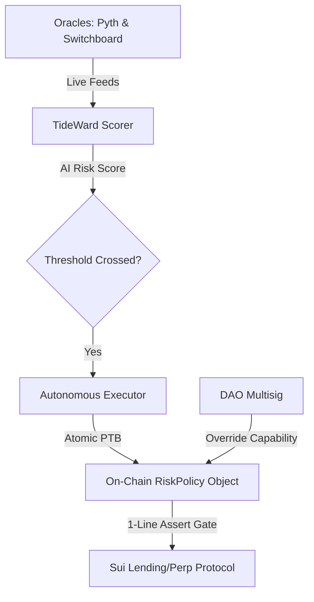

# TideWard 🌊🛡️

  

**Autonomous AI Risk Guardian for Sui DeFi**

*Sui Overflow 2026 Hackathon — Track 0: Agentic Web (Sub-track 1: Autonomous Risk Guardian)*

---

## 🚨 The Pain Point: Static Parameters in Dynamic Markets

DeFi lending and perpetual protocols sit on billions in TVL, yet rely on **static risk parameters** (LTV, borrow caps, interest rates) and **human governance** that takes days to react. When a stablecoin de-pegs or an oracle price deviates, markets collapse in seconds. 

Recent exploits (e.g. Euler, Aave wstETH oracle issues, rsETH bridge exploit) have resulted in **hundreds of millions in bad debt** due to governance latency. Existing EVM monitoring tools only send advisory webhooks; they cannot act autonomously. On Sui, no native autonomous risk-enforcement agent has shipped—leaving protocols vulnerable to correlated oracle failures and rapid liquidity drains.

---

## 💡 The Solution: TideWard

TideWard bridges the gap between off-chain risk intelligence and on-chain enforcement. It runs an autonomous off-chain AI risk agent that interacts directly with a **Sui Move Policy Object** to adjust protocol parameters in real time, whilst preserving absolute DAO control.

### Key Pillars:
1. **Autonomous On-Chain Enforcement**: TideWard does not just send alerts. It executes atomic Programmable Transaction Blocks (PTBs) to adjust parameters (e.g. capping LTV, pausing a market) on-chain.
2. **Move Policy Objects**: Protocols integrate a single assertion line. The core lending code consults the `RiskPolicy` object before execution, securing the protocol at the VM level.
3. **First-Class DAO Override**: Using Sui’s native `Capability` pattern, the protocol DAO holds an `OverrideCap` to instantly revert any autonomous action within a predefined window (e.g. 24 hours).
4. **Granular Blast Radius**: Sui’s object model allows TideWard to scope policies per pool or market (`Policy<BUCK-USDC>`) rather than protocol-wide globals.

---

## 🛠️ Architecture

*   **On-Chain (Sui Move)**: 
    *   `RiskPolicy` object storing LTV caps, pause states, and oracle deviation tolerances.
    *   `OverrideCap` held by the DAO multisig to allow single-click rollbacks.
*   **Off-Chain Scorer**: Containerised Python engine analysing Pyth and Switchboard feeds, calculating a real-time risk index.
*   **Executor**: Node.js service compiling and dispatching atomic PTBs to execute parameter adjustments.
*   **Dashboard**: Next.js interface displaying real-time risk scores, recent automated interventions, and the DAO override trigger.

---

## 🏆 Hackathon MVP Demo Scope

1.  **Real-Time Dashboard**: Visualises SUI, USDC, and BUCK oracle feeds and the live AI risk score.
2.  **Autonomous Intervention**: A simulated de-peg event trips the risk threshold. TideWard autonomously cuts LTV on a devnet lending protocol fork.
3.  **DAO Rollback**: Judges witness a 3-of-5 multisig override reverting the parameter changes via the dashboard.

---

## 🚀 Getting Started

*(Instructions for local development and running the test suite will be populated here during the build phase).*
