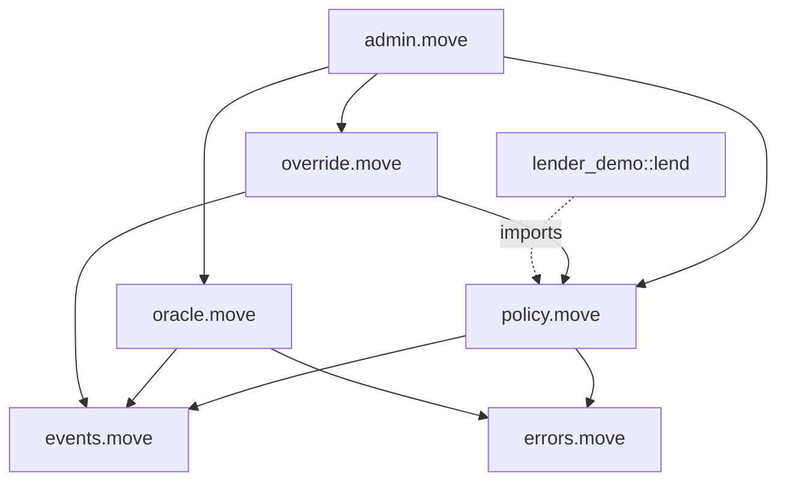

# RiskGuard — System Architecture Specification

- **Version:** 0.1 (hackathon MVP scope, post-hackathon v1 sketch)
- **Date:** 2026-05-28
- **Network target:** Sui testnet (Protocol 124, v1.72.2); mainnet path documented but out-of-scope for MVP
- **Source business spec:** [`BUSINESS_SPEC.md`](../../BUSINESS_SPEC.md)
- **Status:** Draft for review — assumptions flagged with `⚠️ ASSUMPTION`

---

## 0. Scope & Non-Goals

**In scope (MVP, 4 weeks):**
- 3 Pyth feeds (SUI, USDC, BUCK) → off-chain scorer → on-chain `RiskPolicy` mutation via PTB.
- One autonomous action: cap LTV / pause-market on a devnet-forked Suilend-style lender.
- DAO `OverrideCap` (2-of-3 multisig) with `revert_window_ms`.
- Dashboard (Next.js + dApp-kit) with live score, action log, override button.

**Out of scope (MVP):**
- Seal-encrypted weights (v2).
- Cross-protocol contagion model (v2).
- Switchboard secondary feed (v1, but stubbed in interface).
- Mainnet deploy, formal audit, paid insurance feed.
- Real Suilend/Navi integration — use a **fork of a minimal lender module** as integration target.

---

## 1. System Overview

```
┌─────────────────────────────────────────────────────────────┐
│                       OFF-CHAIN                              │
│                                                              │
│  Pyth Hermes ──► Ingestor ──► Scorer (FastAPI) ──► Executor │
│  (WS pull)       (Node)       (Python sklearn)    (Node TS) │
│                                                              │
│                          ▲                       │           │
│                          │                       │ signed    │
│                  Switchboard (v1+)               │ PTB       │
└──────────────────────────┼───────────────────────┼──────────┘
                           │                       │
                           │ (signed Ed25519       │
                           │  attestation)         ▼
┌──────────────────────────┼───────────────────────────────────┐
│                          │      ON-CHAIN (Sui)               │
│                          │                                    │
│                    ┌─────▼──────┐    ┌────────────────┐      │
│                    │ RiskOracle │───►│  RiskPolicy    │      │
│                    │ (shared)   │    │  (shared, per  │      │
│                    └────────────┘    │   market)      │      │
│                                      └───────┬────────┘      │
│                                              │ asserted by   │
│                                              ▼               │
│                                      ┌────────────────┐      │
│                                      │ Lender module  │      │
│                                      │ (consumer)     │      │
│                                      └────────────────┘      │
│                                                              │
│                    OverrideCap (owned by DAO multisig)       │
│                       │                                       │
│                       └──► revert_action(action_id)          │
└──────────────────────────────────────────────────────────────┘
                           │
                           ▼
           ┌───────────────────────────────┐
           │  Indexer (custom, gRPC)       │
           │  ──► Dashboard (Next.js)      │
           │  ──► Telegram alert worker    │
           │  ──► PDF report generator     │
           └───────────────────────────────┘
```

---

## 2. On-Chain Architecture (Move)

### 2.1 Package layout

```
move/riskguard/
├── Move.toml
├── sources/
│   ├── policy.move          # RiskPolicy object + assert API (the gate)
│   ├── oracle.move          # RiskOracle shared object + score posting
│   ├── override.move        # OverrideCap + revert flow
│   ├── events.move          # Event structs (single import surface)
│   ├── errors.move          # E_* error constants
│   └── admin.move           # AdminCap, init, registry
└── tests/
    ├── policy_tests.move
    ├── override_tests.move
    └── e2e_tests.move
```

Consumer-side (lender fork):
```
move/lender_demo/
└── sources/lend.move        # imports riskguard::policy::assert_action_allowed
```

### 2.2 Core objects

| Object | Ownership | Mutability | Purpose |
|---|---|---|---|
| `AdminCap` | owned (RiskGuard ops 2-of-3 multisig) | — | mint/burn publisher caps, mint `EmergencyStopCap`, register markets, `resume_oracle` |
| `RiskOraclePublisherCap` | owned (KMS-managed addr) | — | gates `post_score_and_apply`; bound to specific oracle |
| `EmergencyStopCap` × N | owned (on-call ops hot wallets) | — | one-shot kill switch: `pause_oracle` only |
| `RiskOracle` | **shared** | mut | latest score, freshness ts, `active: bool`, nonce |
| `RiskPolicy<phantom Market>` | **shared** | mut | LTV caps, pause flag, thresholds, revert window |
| `OverrideCap<phantom Market>` | owned (DAO multisig addr) | — | revert any action within `revert_window_ms` |
| `UpgradeRegistry` | **shared** | mut | wraps `UpgradeCap`, enforces 72h timelock (C4) |
| ~~`ActionLog`~~ | — | — | **Removed.** Audit trail = events; revertable state = inline `pending_actions` on `RiskPolicy`. |

**`phantom Market`** = type parameter that identifies the market (e.g., `Market<BUCK, USDC>`). Gives compile-time scoping; one `RiskPolicy<BUCK_USDC>` is incompatible with `Lender<SUI_USDC>` → no cross-market confusion.

### 2.3 Key structs (sketch)

```move
public struct RiskPolicy<phantom M> has key, store {
    id: UID,
    ltv_bps: u16,                          // current LTV cap, e.g. 5000 = 50%
    ltv_default_bps: u16,                  // baseline to restore on revert
    flags: u8,                             // bitfield: BORROWS|LIQUIDATIONS|DEPOSITS|WITHDRAWS paused
    revert_window_ms: u64,                 // e.g. 86_400_000 = 24h
    min_loosen_interval_ms: u64,           // e.g. 3_600_000 = 1h; cooldown for loosening only
    last_loosen_ts_ms: u64,                // for rate limit enforcement
    max_conf_bps: u16,                     // Pyth confidence ceiling (D5)
    oracle_id: ID,                         // bound RiskOracle
    next_action_id: u64,
    pending_actions: vector<ActionSnapshot>, // bounded, MAX_PENDING = 8
}

public struct ActionSnapshot has store, copy, drop {
    action_id: u64,
    kind: u8,            // 0=ltv_cut, 1=flag_set, 2=combined
    prev_ltv_bps: u16,
    prev_flags: u8,
    reason_code: u8,
    ts_ms: u64,
}

const MAX_PENDING: u64 = 8;

public struct RiskOracle has key {
    id: UID,
    active: bool,                 // false = all post_score_and_apply abort (kill switch)
    latest_score_bps: u16,
    latest_score_ts_ms: u64,
    nonce: u64,                   // monotonic, replay protection
    max_staleness_ms: u64,
}
// Note: publisher_pubkey removed — Cap-only auth (B2 decision).
// PublisherCap holder is authenticated by Sui tx signature; separate payload sig was redundant.

public struct OverrideCap<phantom M> has key, store {
    id: UID,
    policy_id: ID,
}

// ActionLog removed — events serve audit; pending_actions on RiskPolicy serves revert.
```

### 2.4 Public API (the gate)

```move
// === Lender-facing gates (per-action, opt-in) ===
public fun assert_borrow_allowed<M>(policy: &RiskPolicy<M>, requested_ltv_bps: u16, clock: &Clock);
public fun assert_liquidate_allowed<M>(policy: &RiskPolicy<M>, clock: &Clock);
public fun assert_deposit_allowed<M>(policy: &RiskPolicy<M>, clock: &Clock);
public fun assert_withdraw_allowed<M>(policy: &RiskPolicy<M>, clock: &Clock);

// === Optional oracle freshness helper ===
public fun assert_oracle_fresh<M>(policy: &RiskPolicy<M>, oracle: &RiskOracle, clock: &Clock);

// === Read-only helpers for off-chain health calcs & frontend ===
public fun current_ltv_cap<M>(policy: &RiskPolicy<M>): u16;
public fun current_flags<M>(policy: &RiskPolicy<M>): u8;
public fun is_borrows_paused<M>(policy: &RiskPolicy<M>): bool;

// Off-chain executor calls this. Gated by RiskOraclePublisherCap.
public struct Decision has copy, drop {
    new_ltv_bps: u16,
    new_flags: u8,
    reason_code: u8,
}

public fun post_score_and_apply<M>(
    _cap: &RiskOraclePublisherCap,
    oracle: &mut RiskOracle,
    policy: &mut RiskPolicy<M>,
    score_bps: u16,
    decision: Decision,
    pyth_price_obj: &PriceInfoObject,
    nonce: u64,                       // monotonic, replay protection
    clock: &Clock,
    // Note: payload signature removed; Cap-holder auth via Sui tx signature (B2)
) {
    // 0. assert oracle.active == true (kill switch); assert cap.oracle_id == id(oracle)
    // 1. prune expired snapshots (revert window passed)
    // 2. assert pending_actions length < MAX_PENDING
    // 3. verify Pyth staleness ≤ 60s, confidence ≤ max_conf_bps, nonce monotonic
    // 4. classify direction: is_tightening / is_loosening (see B3 in spec)
    //    if is_loosening: assert now >= last_loosen_ts_ms + min_loosen_interval_ms
    //                     else abort E_LOOSEN_TOO_SOON
    //                     update last_loosen_ts_ms = now
    //    (tightening: no rate limit)
    // 5. push ActionSnapshot { prev_ltv_bps, prev_flags, reason_code, ts_ms }
    // 6. policy.ltv_bps = decision.new_ltv_bps; policy.flags = decision.new_flags
    // 7. emit ActionExecuted event
}

// DAO multisig calls this within revert_window_ms.
// CASCADES: reverting action N also drops all snapshots after N (their prev_* would now be stale).
public fun revert_action<M>(
    _cap: &OverrideCap<M>,
    policy: &mut RiskPolicy<M>,
    action_id: u64,
    clock: &Clock,
) {
    // 1. find action_id in pending_actions
    // 2. assert clock.ts_ms <= snap.ts_ms + revert_window_ms
    // 3. restore policy.ltv_bps / policy.flags from snapshot
    // 4. pop_back until index, removing cascading actions
    // 5. emit ActionReverted event
}
```

Lender integration = **one import + bind-once + 2-line gate per sensitive entry** (gate function picked per action type):

```move
use riskguard::policy::{Self, RiskPolicy, MarketTag, assert_action_allowed};

public struct Market<phantom C, phantom D> has key {
    id: UID,
    policy_id: ID,  // bound at market creation, immutable
    // ... other lender state
}

// On market creation, bind the RiskGuard-issued policy:
public entry fun create_market<C, D>(
    policy: &RiskPolicy<MarketTag<C, D>>,
    ctx: &mut TxContext,
) {
    let market = Market<C, D> {
        id: object::new(ctx),
        policy_id: object::id(policy),
        // ...
    };
    transfer::share_object(market);
}

public entry fun borrow<C, D>(
    market: &mut Market<C, D>,
    policy: &RiskPolicy<MarketTag<C, D>>,
    amount: u64,
    clock: &Clock,
    ctx: &mut TxContext,
) {
    assert!(object::id(policy) == market.policy_id, E_WRONG_POLICY);  // anti-spoof
    let requested_ltv = compute_ltv(market, amount);
    assert_borrow_allowed(policy, requested_ltv, clock);
    // ... rest of borrow
}

public entry fun liquidate<C, D>(
    market: &mut Market<C, D>,
    policy: &RiskPolicy<MarketTag<C, D>>,
    target: address,
    clock: &Clock,
    ctx: &mut TxContext,
) {
    assert!(object::id(policy) == market.policy_id, E_WRONG_POLICY);
    assert_liquidate_allowed(policy, clock);
    // ... liquidation logic
}
```

**Why 2 lines, not 1:** `phantom M` blocks cross-market spoofing at compile time, but same-type instance spoofing (attacker forges a `RiskPolicy<MarketTag<C,D>>` set to always-allow) needs the `object::id` bind check at runtime. The `policy_id` is locked at market-creation time and immutable thereafter.

**Policy ID discovery:** off-chain. Indexer subscribes to `MarketRegistered` events, materializes `TypeName → PolicyID` to Postgres. Lender ops paste the ID into their `create_market` PTB once. No on-chain `PolicyRegistry` shared object — would be a consensus hot spot for read-mostly data, not worth it.

### 2.5 Events

```move
public struct ScorePosted has copy, drop { market: TypeName, score_bps: u16, ts_ms: u64, nonce: u64 }
public struct ActionExecuted has copy, drop { action_id: u64, market: TypeName, kind: u8, prev_ltv: u16, new_ltv: u16, score_bps: u16, ts_ms: u64 }
public struct ActionReverted  has copy, drop { action_id: u64, market: TypeName, by: address, ts_ms: u64 }
public struct PolicyPaused    has copy, drop { market: TypeName, ts_ms: u64 }
```

Indexer subscribes to these via gRPC subscription stream.

### 2.6 Errors

`E_BORROWS_PAUSED = 1`, `E_LIQUIDATIONS_PAUSED = 2`, `E_DEPOSITS_PAUSED = 3`, `E_WITHDRAWS_PAUSED = 4`, `E_LTV_EXCEEDED = 5`, `E_STALE_ORACLE = 6`, `E_REPLAY = 7`, `E_REVERT_WINDOW_CLOSED = 8`, `E_UNKNOWN_ACTION = 9`, `E_CONF_TOO_WIDE = 10`, `E_TOO_MANY_PENDING = 11`, `E_WRONG_ORACLE = 12`, `E_LOOSEN_TOO_SOON = 13`, `E_ORACLE_PAUSED = 14`. Lender-side: `E_WRONG_POLICY = 1001`.

### 2.7 Capabilities matrix

| Capability | Holder | Powers |
|---|---|---|
| `AdminCap` | RiskGuard ops 2-of-3 Sui multisig | mint/burn `PublisherCap`, mint `EmergencyStopCap`, register markets, `resume_oracle` |
| `RiskOraclePublisherCap` | KMS-managed Sui address (AWS KMS Ed25519) | `post_score_and_apply` only; bound to one `RiskOracle` |
| `EmergencyStopCap` × N | each on-call ops member's hot wallet | `pause_oracle` only — asymmetric one-way kill switch |
| `OverrideCap<M>` | DAO multisig addr (per market) | revert any action in window |

**Separation of duties on-chain:** no single key can both post scores AND revert. Stop is fast (any `EmergencyStopCap` holder, single signer). Resume is slow (`AdminCap` 2-of-3). See §B2 in §3 for rotation & custody.

### 2.8 Upgradeability (C4)

- `UpgradeCap` wrapped in shared `UpgradeRegistry` object. Raw cap never exposed.
- **72h timelock**, single class, no fast path. Emergencies use `pause_oracle` (B2).
- API:
  - `propose_upgrade(AdminCap, registry, digest, policy)` — gated by AdminCap (2-of-3)
  - `execute_upgrade(registry, clock) → UpgradeTicket` — **permissionless** after timelock, prevents RG squatting on pending
  - `cancel_upgrade(AdminCap, registry)` — velocity risk mitigated by event transparency + SaaS SLA (cancel rate > 30%/mo = breach), not on-chain limit
- MVP: `timelock_ms = 259_200_000` hardcoded. v1: meta-timelock for changing timelock itself.
- Events: `UpgradeProposed`, `UpgradeCancelled`, `UpgradeExecuted` — all indexed for dashboard.
- **Resolved (2026-05-29)**: `UpgradeCap` upgrades to **3-of-5 multisig with 2 external trustees** before mainnet launch. `AdminCap` stays 2-of-3 ops (high-frequency ops: register market, resume oracle). Rationale: UpgradeCap can rewrite bytecode and bypass every other cap → root-of-trust must be the slowest, widest-attested key. Testnet/MVP keeps 2-of-3 as known limitation (documented in §5.1 threat model). 72h timelock gives trustees time to read diff before signing — no extra latency vs 2-of-3.
- Object layouts use `vector<u8>` extension fields where future-proofing is critical (`RiskPolicy.reserved: vector<u8>`). ⚠️ ASSUMPTION: acceptable trade-off for hackathon.

---

## 3. Off-Chain Architecture

### 3.1 Components

| Component | Tech | Responsibility |
|---|---|---|
| Ingestor | Node 22 + `@pythnetwork/hermes-client` | Subscribe to Pyth Hermes WS, normalize, push to scorer |
| Scorer | Python 3.12 + FastAPI + scikit-learn | Rule layer + logistic model → `score_bps` in [0, 10000] |
| Executor | Node 22 + `@mysten/sui` (gRPC) | Build/sign PTB, submit, retry, alert on failure |
| Indexer | Custom (Rust or TS via `sui-indexer`) | Subscribe to events, materialize to Postgres |
| Frontend | Next.js 16 + dApp-kit + zkLogin | Dashboard, override UI |
| Alerter | Worker (TS) | Telegram + Slack push on `ActionExecuted` |
| Report gen | Worker (TS) + Walrus | Monthly PDF, blob stored on Walrus (v1) |

### 3.2 Scorer interface

```
POST /score
{
  "market": "BUCK_USDC",
  "pyth": { "price": 0.94, "conf": 0.002, "ema": 0.99, "ts": ... },
  "switchboard": { ... } | null,
  "context": { "twap_60s": 0.93, "liquidity_drain_pct": 12.4 }
}
→ 200
{
  "score_bps": 8400,
  "rule_trace": ["depeg>3%", "twap_diverge"],
  "model_prob": 0.79,
  "action_recommended": { "kind": "ltv_cut", "new_ltv_bps": 5000 }
}
```

Determinism: rule layer is the **source of truth**; ML model output is appended but not load-bearing for MVP. Rule layer's threshold crossing triggers the executor.

### 3.3 Executor flow

```
on score >= threshold AND debounce_window_passed:
  1. fetch fresh Pyth update bytes (Hermes)
  2. build PTB:
       a. pyth::update_single_price_feed(...)
       b. riskguard::policy::post_score_and_apply(...)
  3. sign with publisher hot key (rotated weekly, kms-backed)
  4. submit via gRPC, with retry (exponential, max 3)
  5. on success: emit internal event → alerter
  6. on failure: page on-call, do NOT auto-retry past 3
```

Hot key blast radius capped by `RiskOraclePublisherCap` scope — it can only call `post_score_and_apply`, nothing else.

### 3.4 Signature scheme

⚠️ ASSUMPTION: Sui's tx signature already authenticates the publisher (it's the cap holder). The `signature` field in `post_score_and_apply` is **belt-and-suspenders** for off-chain auditability — verifies the score payload came from the scorer (not just any cap holder). Drop if v1 doesn't need it.

---

## 4. Data Layer

| Need | Choice | Why |
|---|---|---|
| Live policy state (read) | **gRPC** | GA, lowest latency for executor pre-flight checks |
| Frontend queries (action log, policies) | **GraphQL (beta)** | Frontend-friendly, batchable |
| Historical analytics / replay | **Custom indexer** (`sui-indexer`) | Adaptive concurrency, backfill, Postgres sink |
| JSON-RPC | ❌ Not used | Deprecated (Quorum Driver disabled, removal Apr 2026) |

---

## 5. Security Considerations

### 5.1 Threat model (≤5 vectors for the red team review)

1. **Publisher key compromise.** Attacker posts score=0, lifts LTV cap. → Mitigation: cap scope is *post only*; cannot remove pause flag → reduce LTV. Stretch mitigation: rate-limit `post_score_and_apply` to once per N blocks per market.
2. **Replay / nonce skip.** Old signed score replayed. → Mitigation: `nonce` monotonic, `latest_score_ts_ms` enforced strictly increasing.
3. **DAO override key compromise.** Attacker mass-reverts protective actions. → Mitigation: `OverrideCap` held by k-of-n multisig (start 2-of-3, target 3-of-5); per-market scoping limits blast radius.
4. **Oracle staleness exploitation.** Lender reads stale policy because oracle hasn't been updated. → Mitigation: `assert_action_allowed` requires `clock` and checks oracle `max_staleness_ms` (default 60s); on staleness, default to **most conservative** policy, not loosest.
5. **Integer overflow on LTV math.** All LTV in `u16` bps (0..=10000), explicit `assert!(bps <= 10000)`. Borrow amounts in `u64`, computed via `(amount as u128) * bps / 10000` then narrowed.
6. **Griefing via shared object contention.** Many writers to `ActionLog` could be DoSed. → MVP accepts this; v1 shards log per market.

### 5.2 Audit/red team path

Pre-mainnet: run `sui-security-guard` (static) → `sui-red-team` (adversarial tests for vectors 1-5 above) → external audit (OtterSec / Movebit). Out of scope for hackathon.

---

## 6. Testing Strategy

| Layer | Tool | What |
|---|---|---|
| Move unit | `sui move test` | Per-function: LTV math, nonce, revert window, cap gating |
| Move integration | `sui move test` w/ scenarios | Score → action → revert → restore lifecycle |
| Monkey/fuzz | hand-written + `sui-red-team` | Random bps values, out-of-window reverts, wrong-cap callers |
| Off-chain unit | pytest, jest | Scorer rules, executor PTB build |
| E2E | localnet + playwright | Devnet fork → simulate depeg → see dashboard react |

Per project rule: **Monkey Testing required after unit + integration.**

---

## 7. Deployment Plan

1. **Devnet** (week 1-2): Move modules + minimal lender fork; manual PTB execution.
2. **Devnet automated** (week 3): full pipeline live, scripted depeg sim for demo.
3. **Testnet** (post-hackathon week 1-2): one design-partner lender, real Pyth feeds.
4. **Mainnet** (Q4 2026): post audit + 60-day testnet bake.

`UpgradeCap` held by RiskGuard ops 2-of-3 multisig. Each upgrade gated by changelog + diff posted to a public repo.

---

## 8. Gas & Performance

- `post_score_and_apply` target: < 5M gas units (Pyth update is the dominant cost, ~3-4M).
- `assert_action_allowed` is a read-only pure check, ~50k gas.
- Indexer cold-start backfill: use `ConcurrencyConfig` (not removed `Processor::FANOUT`).

---

## 9. Frontend Spec (summary)

- Routes: `/` (live score + policies), `/actions` (log), `/override` (DAO multisig UI), `/report` (PDF gen).
- Auth: zkLogin (Google) for read; wallet connect (Sui Wallet, Suiet) for write (override).
- State: `@mysten/dapp-kit` hooks + TanStack Query.
- Tx flow: build PTB in browser, multisig partial-sign via dApp-kit + Sui multisig API.

---

## 9.5 Pyth Feed Inventory & Constraints (verified 2026-05-28)

| Asset | Stable (mainnet) feed ID | Beta (testnet) feed ID | Sponsored? |
|---|---|---|---|
| SUI/USD | `0x23d7315113f5b1d3ba7a83604c44b94d79f4fd69af77f804fc7f920a6dc65744` ⚠️ verify | `0x50c67b3fd225db8912a424dd4baed60ffdde625ed2feaaf283724f9608fea266` | Yes |
| USDC/USD | (sponsored, see Pyth docs) | (sponsored) | Yes |
| **BUCK/USD** | `0xfdf28a46570252b25fd31cb257973f865afc5ca2f320439e45d95e0394bc7382` | `0xed0899e3a021f1e59031ad365bb3014d78f9ba5556e263692d3508b9272daabf` | **No — self-pay** |

**Architectural implications of BUCK being non-sponsored:**

1. Every PTB touching BUCK price must include `pythClient.updatePriceFeeds(tx, ...)` upstream — gas + Hermes RTT (~200-500ms) per action. Acceptable for risk-action PTBs (low frequency), expensive for per-borrow lender reads.
2. **Confidence interval is load-bearing** for low-liquidity stable feeds. `assert_action_allowed` and scorer must check `conf/price < 0.005` (50 bps). Add `max_conf_bps: u16` field to `RiskPolicy`.
3. **Hard 60s staleness ceiling** for BUCK in Move-side assertion (`pyth::get_price_no_older_than(po, clock, 60)`). Below 60s = abort with `E_STALE_ORACLE`, default-conservative path.

**Fallback oracle ladder** (for §5.1 threat #4 mitigation):

1. Primary: Pyth BUCK/USD (above).
2. Secondary (v1, **mainnet-only**): **Cetus CLMM BUCK/USDC pool TWAP** — read via Cetus pool object, 5min TWAP. Bucket's own deepest liquidity lives here, so divergence vs Pyth → genuine de-peg signal.
   - Mainnet pool object IDs (verified 2026-05-29 via codex/GeckoTerminal):
     - Native USDC/BUCK 0.01% fee: `0x4c50ba9d1e60d229800293a4222851c9c3f797aa5ba8a8d32cc67ec7e79fec60` (preferred)
     - Legacy bridged USDC/BUCK 0.01%: `0xd4573bdd25c629127d54c5671d72a0754ef47767e6c01758d6dc651f57951e7d`
   - **Testnet**: no BUCK/USDC Cetus pool exists (confirmed via Cetus SDK config + GitHub). Testnet MVP degrades to **Pyth + staleness/confidence-only** fallback; Cetus adapter code ships but is not registered with a pool ID on testnet deploy.
3. Tertiary (v2): Switchboard On-Demand custom feed.

Divergence between primary and secondary = high-confidence depeg signal for scorer (lower false-positive than Pyth-only). Pool ID is a deploy-time config in `oracle.move`, not hardcoded — testnet/mainnet swap without recompile.

---

## 10. Open Questions / Assumptions Needing Confirmation

1. ⚠️ Is the integration target a **real Suilend fork** or a **toy lender** we control? Affects demo credibility vs scope.
2. ⚠️ MVP scorer: rule-only is sufficient for demo, or must ML model output be wired through? (Recommendation: rule-only, ML as appended trace.)
3. ⚠️ `OverrideCap` granularity — one per market (proposed) vs one global. Per-market is safer but more multisig setup.
4. ⚠️ Signature-on-payload (§3.4) — keep or drop?
5. ⚠️ Walrus storage for action log archival — MVP or v1?
6. ✅ Pyth integration confirmed (2026-05-28): use TS `SuiPythClient.updatePriceFeeds(tx, ...)` upstream of `post_score_and_apply`; **do not** call `update_single_price_feed` from Move (per Pyth integration guidance — upgrade hazard).
7. ✅ Cetus pool object IDs (resolved 2026-05-29): mainnet native USDC/BUCK = `0x4c50...ec60`, legacy = `0xd457...1e7d`. **Testnet has NO BUCK/USDC Cetus pool** — MVP fallback ladder downgrades to Pyth + staleness/confidence-only on testnet. Cetus adapter ships as code but is not pool-registered on testnet deploy.
8. ✅ UpgradeCap custody (resolved 2026-05-29): mainnet pre-launch swap to 3-of-5 with 2 external trustees. AdminCap stays 2-of-3 ops. Testnet/MVP keeps 2-of-3 (known limitation).

---

## 11. Module Dependency Diagram (Mermaid)



---

## 12. Next Steps

1. User reviews this spec, resolves Q1-Q6 in §10.
2. → `sui-developer` skill: implement `policy.move`, `oracle.move`, `override.move`.
3. → `sui-tester`: unit + integration + monkey tests.
4. → off-chain executor + scorer in parallel (separate chats per project rule).
5. → `sui-red-team` after Move modules compile.
6. → frontend + dashboard.
